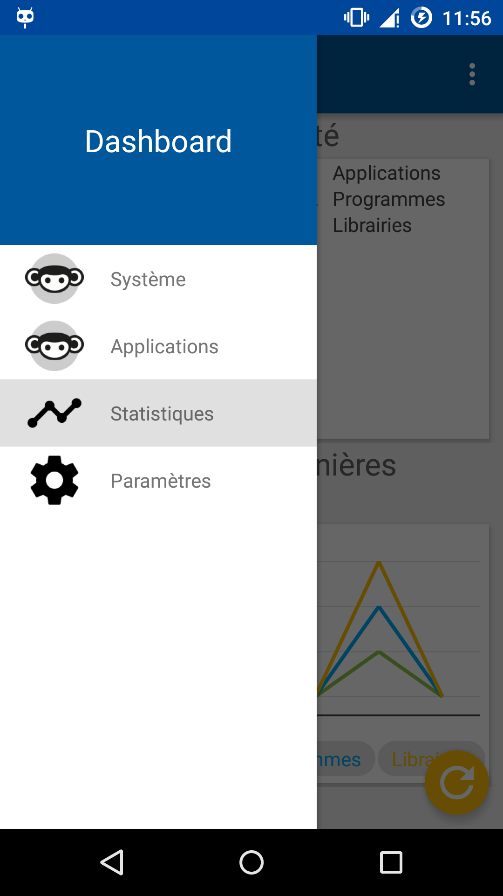
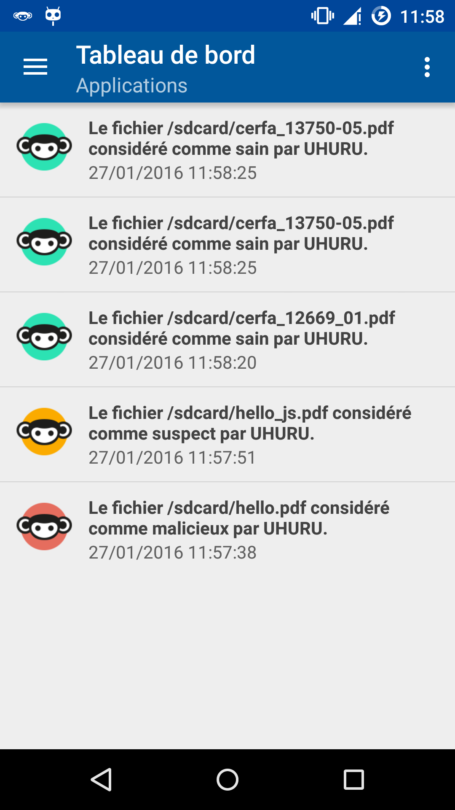
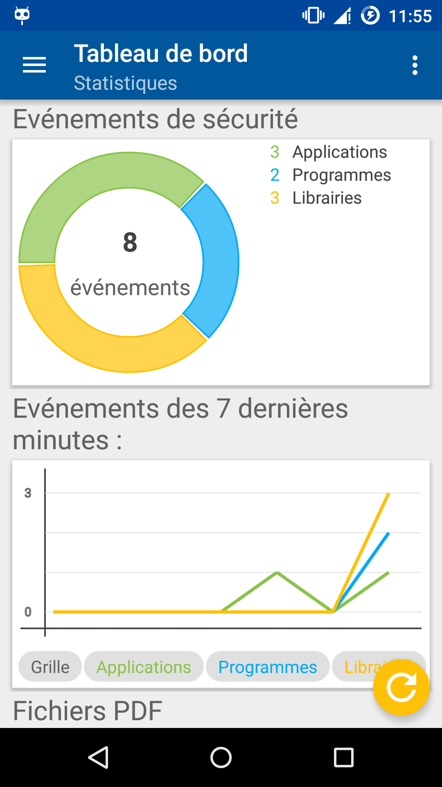
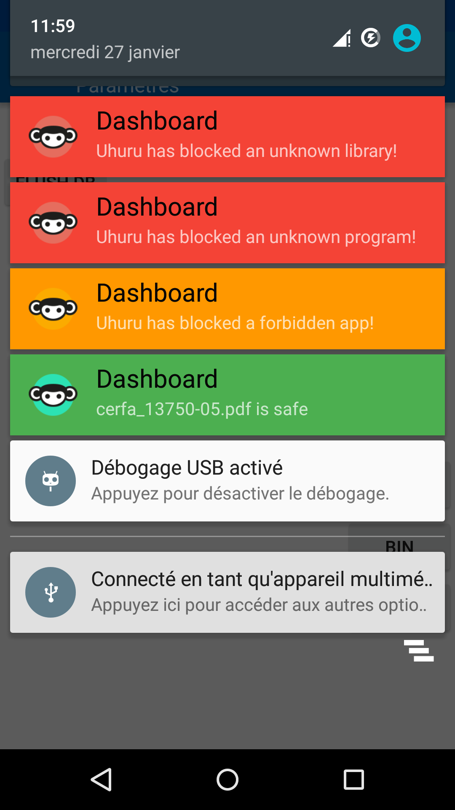

# UHURU Dasboard

## Description

Le dashboard UHURU permet de concentrer l'ensemble des événements du système UHURU afin de les présenter de manière lisible à un utilisateur. Il embarque de plus un fileObserver afin de passer tous les PDF téléchargés au module d'analyse [PDF](http://gitlab.prod.teclib.infra/uhuru-av-root/uhurupdf) d'UHURU.
Enfin, le dashboard permet de générer des statistiques sur les événements (proportions, dernières occurrences, ...)

## Screenshots

